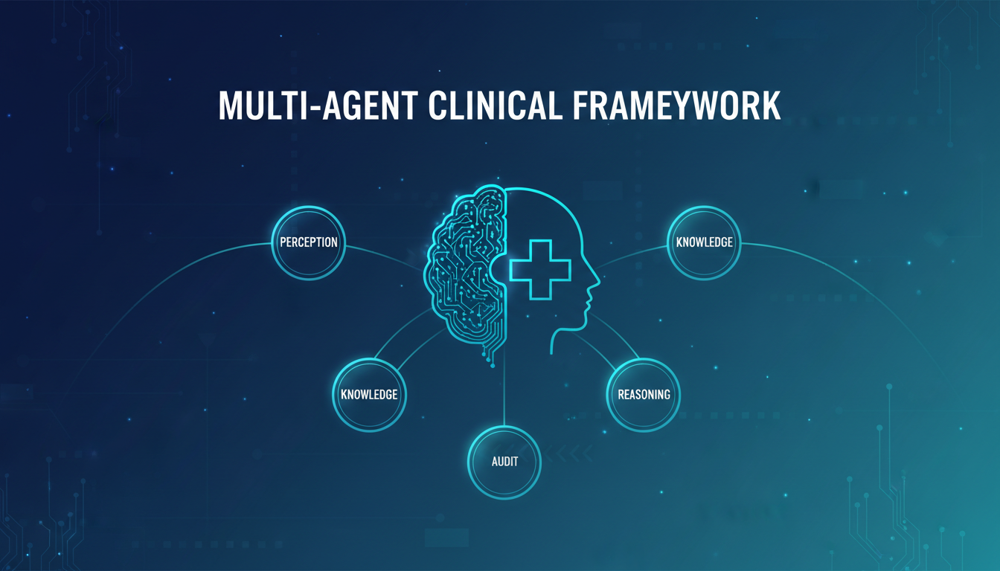

# A Multi-Agent Evaluation Framework for Clinical Mental Health Diagnosis

<p align="center">
  
</p>

<p align="center">
  
  
  
  
  
  
</p>

<p align="center">
  <a href="https://github.com/Rising-Stars-by-Sunshine/A-Multi-Agent-Evaluation-Framework-for-Clinical-Mental-Health-Diagnosis/stargazers">
    
  </a>
  <a href="https://github.com/Rising-Stars-by-Sunshine/A-Multi-Agent-Evaluation-Framework-for-Clinical-Mental-Health-Diagnosis/forks">
    
  </a>
  <a href="https://github.com/Rising-Stars-by-Sunshine/A-Multi-Agent-Evaluation-Framework-for-Clinical-Mental-Health-Diagnosis/issues">
    
  </a>
  <a href="https://github.com/Rising-Stars-by-Sunshine/A-Multi-Agent-Evaluation-Framework-for-Clinical-Mental-Health-Diagnosis/commits/main">
    
  </a>
</p>

<p align="center">
  <a href="https://www.python.org/">
    
  </a>
  <a href="https://ollama.com/">
    
  </a>
  <a href="https://www.langchain.com/">
    
  </a>
  <a href="https://opensource.org/licenses/MIT">
    
  </a>
</p>

---

## Table of Contents

- [Overview](#overview)
  - [The Four-Agent Architecture](#the-four-agent-architecture)
  - [Key Contributions](#key-contributions)
- [System Architecture](#system-architecture)
- [Repository Structure](#repository-structure)
- [Prerequisites](#prerequisites)
  - [System Requirements](#system-requirements)
  - [Software Dependencies](#software-dependencies)
  - [Ollama Setup](#ollama-setup)
- [Dataset](#dataset)
  - [Obtaining DAIC-WOZ](#obtaining-daic-woz)
  - [Expected Directory Layout](#expected-directory-layout)
  - [Data Split](#data-split)
- [Model Configuration](#model-configuration)
- [Installation](#installation)
- [Usage](#usage)
  - [Quick Start](#quick-start)
  - [Running Multi-Agent Pipeline](#running-multi-agent-pipeline)
  - [Running Single-Agent Baselines](#running-single-agent-baselines)
  - [Running Ablation Studies](#running-ablation-studies)
  - [Evaluating Results](#evaluating-results)
- [Evaluation Metrics](#evaluation-metrics)
- [Expected Results](#expected-results)
- [Process Metrics & Quality Indicators](#process-metrics--quality-indicators)
- [Privacy & Clinical Use Disclaimer](#privacy--clinical-use-disclaimer)
- [Citation](#citation)
- [License](#license)
- [Acknowledgments](#acknowledgments)
- [Contributing](#contributing)
- [Contact](#contact)

---

## Overview

This repository contains the official implementation of a **multi-agent evaluation framework for clinical mental health diagnosis**. The project studies whether collaborative Large Language Model (LLM) workflows can improve the **reliability**, **interpretability**, and **factual consistency** of PHQ-8 depression severity prediction on the DAIC-WOZ clinical interview dataset.

> **Dataset:** [DAIC-WOZ Depression Database](https://dcapswoz.ict.usc.edu/)

Conventional single-model zero-shot prompting can identify psychological signals from conversational text, but it often suffers from:
- **Hallucinated reasoning**
- **Weak verification**
- **Limited transparency** in sensitive diagnostic tasks

This framework addresses these limitations by decomposing the diagnostic process into **specialized agents** implemented with a modular **LangGraph** workflow.

### The Four-Agent Architecture

The proposed system simulates a collaborative clinical consultation process with four specialized agents:

| Agent | Model | Role | Description |
|:---:|:---:|:---|:---|
| 🔍 **Perception** | `llama3.1:8b` | Signal Extraction | Extracts symptom-relevant behavioral signals from patient transcripts and visual action unit (AU) summaries |
| 📚 **Knowledge** | `nomic-embed-text` | RAG Retrieval | Retrieves psychiatric references with retrieval-augmented generation using embeddings and top-k retrieval |
| 🧠 **Reasoning** | `deepseek-r1:8b` | Clinical Inference | Performs structured PHQ-8 item-level clinical inference and produces evidence-grounded severity scores |
| ✅ **Audit** | `qwen2.5:7b` | Verification | Verifies diagnostic consistency, detects unsupported inference, and revises predictions when evidence is insufficient |

All models are deployed **locally through Ollama** to preserve the privacy of clinical data.

### Key Contributions

- ✅ A **modular multi-agent framework** for clinical mental health diagnosis using collaborative LLM workflows
- ✅ An integrated pipeline combining **behavioral perception**, **RAG-based psychiatric grounding**, **structured clinical reasoning**, and **audit-based verification**
- ✅ A **reproducible experimental setup** for comparing single-agent baselines, multi-agent orchestration, and ablated pipeline variants on DAIC-WOZ
- ✅ **Process-oriented evaluation metrics** for reasoning reliability, interpretability, audit correction, hallucination detection, and knowledge grounding

---

## System Architecture

```
┌─────────────────────────────────────────────────────────────────────┐
│                     MULTI-AGENT DIAGNOSTIC PIPELINE                  │
└─────────────────────────────────────────────────────────────────────┘

  ┌──────────┐      ┌──────────┐      ┌──────────┐      ┌──────────┐
  │  Percep- │ ──▶  │  Knowl-  │ ──▶  │  Reas-   │ ──▶  │  Audit   │
  │  tion    │      │  edge    │      │  oning   │      │          │
  │  Agent   │      │  Agent   │      │  Agent   │      │  Agent   │
  │          │      │  (RAG)   │      │          │      │          │
  └────┬─────┘      └────┬─────┘      └────┬─────┘      └────┬─────┘
       │                 │                 │                 │
       ▼                 ▼                 ▼                 ▼
  ┌──────────────────────────────────────────────────────────────────┐
  │                     SHARED STATE (LangGraph)                      │
  │  • transcript_text  • perception_log  • phq8_scores  • revised   │
  │  • au_summary       • knowledge_base  • severity     • score    │
  │  • participant_id   • retrieval_docs  • reasoning    • audit    │
  │                       & scores        • logs         • notes   │
  └──────────────────────────────────────────────────────────────────┘

  ┌──────────────────────────────────────────────────────────────────┐
  │                    LOCAL DEPLOYMENT (Ollama)                      │
  │         🔒 All clinical data stays on-premise — Zero API          │
  └──────────────────────────────────────────────────────────────────┘
```

---

## Repository Structure

```
.
├── LICENSE                         # MIT License
├── README.md                       # This file
├── main.py                         # Quick-start benchmark entry point
├── requirements.txt                # Python dependencies
├── .gitignore                      # Git ignore rules
├── config/
│   └── default.yaml                # Default model & pipeline configuration
├── src/                            # Core framework source code
│   ├── __init__.py
│   ├── agents.py                   # LangGraph agent nodes (Perception, Knowledge, Reasoning, Audit)
│   ├── graph.py                    # Multi-agent workflow definition
│   ├── state.py                    # Shared graph state and data structures
│   ├── utils.py                    # DAIC-WOZ transcript and AU feature loading utilities
│   ├── data_split.py               # Session-level split generator
│   ├── knowledge_base.py           # Psychiatric reference retrieval (RAG + fallback)
│   └── txt_to_csv.py               # Text-to-CSV conversion utility
├── experiments/                    # Experiment runners & evaluation
│   ├── __init__.py
│   ├── runner.py                   # Single/multi-agent and ablation orchestrator
│   └── evaluate.py                 # Metrics, confidence intervals, and statistical tests
├── tests/                          # Unit & connectivity tests
│   ├── __init__.py
│   └── test_langgraph.py           # LangGraph connectivity tests
├── data/                           # Dataset directory (user-provided; gitignored)
│   ├── raw/                        # Original DAIC-WOZ files
│   ├── processed/                  # Runtime-generated processed data
│   └── splits/                     # Pre-generated split CSVs
│       ├── development.csv
│       ├── validation.csv
│       └── test.csv
├── results/                        # Experiment outputs (gitignored)
└── docs/                           # Documentation assets
    └── banner.png
```

---

## Prerequisites

### System Requirements

| Requirement | Minimum | Recommended |
|:---:|:---:|:---:|
| **OS** | Linux / macOS / WSL2 | Ubuntu 22.04 LTS |
| **Python** | 3.8 | 3.10+ |
| **RAM** | 16 GB | 32 GB+ |
| **GPU** | CPU-only (slow) | NVIDIA GPU with 8GB+ VRAM |
| **Disk** | 10 GB free | 50 GB free (for models + data) |

### Software Dependencies

| Package | Version | Purpose |
|:---:|:---:|:---|
| `langchain-core` | ≥ 0.2.0 | Core LangChain abstractions |
| `langchain-ollama` | ≥ 0.1.0 | Ollama LLM integration |
| `langgraph` | ≥ 0.1.0 | Multi-agent workflow orchestration |
| `pandas` | ≥ 2.0.0 | Data manipulation and I/O |
| `numpy` | ≥ 1.24.0 | Numerical computations |
| `scipy` | ≥ 1.10.0 | Statistical tests (t-tests) |
| `tqdm` | ≥ 4.65.0 | Progress bars |

### Ollama Setup

1. **Install Ollama:**
   ```bash
   # macOS / Linux
   curl -fsSL https://ollama.com/install.sh | sh

   # Or visit: https://ollama.com/download
   ```

2. **Pull the required models:**
   ```bash
   ollama pull llama3.1:8b
   ollama pull deepseek-r1:8b
   ollama pull qwen2.5:7b
   ollama pull nomic-embed-text
   ```

3. **Verify installation:**
   ```bash
   ollama list
   ```

---

## Dataset

### Obtaining DAIC-WOZ

The experiments use the **DAIC-WOZ clinical interview dataset** for PHQ-8 depression severity prediction. After data purification, **184 validated sessions** are split at the session level into development, validation, and held-out test subsets. This prevents transcripts from the same participant from appearing across multiple subsets.

> **Note:** The dataset is **not included** in this repository. Users must obtain DAIC-WOZ through the [official data access procedure](https://dcapswoz.ict.usc.edu/) and configure the dataset path locally.

### Expected Directory Layout

```
data/raw/
├── data_split_Depression_AVEC2017.csv    # Session metadata and PHQ-8 labels
├── 300_TRANSCRIPT.csv                    # Sample transcript (session 300)
├── 300_CLNF_AUs.csv                      # Facial Action Units (session 300)
├── 301_TRANSCRIPT.csv                    # Sample transcript (session 301)
├── 301_CLNF_AUs.csv                      # Facial Action Units (session 301)
└── ...                                   # Additional session files
```

### Data Split

Create the development, validation, and held-out test splits after data purification:

```bash
python src/data_split.py --seed 42
```

**Output:**

| File | Sessions | Purpose |
|:---:|:---:|:---|
| `data/splits/development.csv` | 128 (69.6%) | Model development & prompt tuning |
| `data/splits/validation.csv` | 19 (10.3%) | Hyperparameter validation |
| `data/splits/test.csv` | 37 (20.1%) | Held-out evaluation |
| `data/splits/split_manifest.json` | — | Split metadata and counts |

The split is generated at the **session level** and validates that **no participant appears in more than one subset**.

---

## Model Configuration

All experiments use **locally deployed Ollama models**. The default configuration is:

| Component | Model | Temperature | Role |
|:---:|:---:|:---:|:---|
| Perception Agent | `llama3.1:8b` | 0.1 | Behavioral signal extraction |
| Knowledge Retrieval | `nomic-embed-text` | — | Embedding-based RAG (top-k = 3) |
| Reasoning Agent | `deepseek-r1:8b` | 0.2 | Clinical PHQ-8 scoring |
| Audit Agent | `qwen2.5:7b` | 0.0 | Consistency verification |

> **Note:** No parameter fine-tuning or gradient-based optimization is performed. All experiments are **inference-only**.

The knowledge retrieval module falls back to **deterministic lexical matching** if the local Ollama embedding interface is unavailable.

---

## Installation

1. **Clone the repository:**
   ```bash
   git clone https://github.com/Rising-Stars-by-Sunshine/clinagent.git
   cd clinagent
   ```

2. **Create a virtual environment:**
   ```bash
   python -m venv venv
   source venv/bin/activate  # Linux/macOS
   # venv\Scripts\activate  # Windows
   ```

3. **Install dependencies:**
   ```bash
   pip install -r requirements.txt
   ```

4. **Configure dataset path:**
   ```bash
   # Set the environment variable or pass --data-root in commands
   export DAIC_WOZ_PATH=/path/to/your/data/raw
   ```

---

## Usage

### Quick Start

Run the full multi-agent pipeline on the held-out test set:

```bash
python main.py --data-root $DAIC_WOZ_PATH --split-csv data/splits/test.csv
```

### Running Multi-Agent Pipeline

Run the full multi-agent pipeline on the held-out test set across three random seeds:

```bash
python experiments/runner.py \
  --data-root $DAIC_WOZ_PATH \
  --split-csv data/splits/test.csv \
  --split-name test \
  --mode multi_agent \
  --config full_pipeline \
  --output-dir results/full_pipeline
```

### Running Single-Agent Baselines

Compare against single-agent baselines using each model independently:

```bash
# Llama 3.1 baseline
python experiments/runner.py \
  --data-root $DAIC_WOZ_PATH \
  --split-csv data/splits/test.csv \
  --split-name test \
  --mode single_agent \
  --single-agent-model llama3.1:8b \
  --output-dir results/single_llama31

# Qwen 2.5 baseline
python experiments/runner.py \
  --data-root $DAIC_WOZ_PATH \
  --split-csv data/splits/test.csv \
  --split-name test \
  --mode single_agent \
  --single-agent-model qwen2.5:7b \
  --output-dir results/single_qwen25

# DeepSeek-R1 baseline
python experiments/runner.py \
  --data-root $DAIC_WOZ_PATH \
  --split-csv data/splits/test.csv \
  --split-name test \
  --mode single_agent \
  --single-agent-model deepseek-r1:8b \
  --output-dir results/single_deepseek
```

### Running Ablation Studies

Systematically evaluate the contribution of each agent:

| Configuration | Agents Enabled | Command |
|:---:|:---|:---|
| `full_pipeline` | Perception + Knowledge + Reasoning + Audit | `python experiments/runner.py --data-root $DAIC_WOZ_PATH --split-csv data/splits/test.csv --split-name test --mode multi_agent --config full_pipeline --output-dir results/full_pipeline` |
| `audit_only` | Perception + Reasoning + Audit | `python experiments/runner.py --data-root $DAIC_WOZ_PATH --split-csv data/splits/test.csv --split-name test --mode multi_agent --config audit_only --output-dir results/audit_only` |
| `knowledge_no_rag` | Perception + Knowledge (static) + Reasoning | `python experiments/runner.py --data-root $DAIC_WOZ_PATH --split-csv data/splits/test.csv --split-name test --mode multi_agent --config knowledge_no_rag --output-dir results/knowledge_no_rag` |
| `basic_core_only` | Perception + Reasoning only | `python experiments/runner.py --data-root $DAIC_WOZ_PATH --split-csv data/splits/test.csv --split-name test --mode multi_agent --config basic_core_only --output-dir results/basic_core_only` |

### Evaluating Results

Summarize MAE, standard deviation across seeds, bootstrap confidence intervals, and process metrics:

```bash
python experiments/evaluate.py \
  --inputs \
    results/full_pipeline \
    results/audit_only \
    results/knowledge_no_rag \
    results/basic_core_only \
    results/single_llama31 \
    results/single_qwen25 \
    results/single_deepseek \
  --output-dir results_summary \
  --bootstrap-iterations 1000
```

**Generated outputs:**

| File | Description |
|:---:|:---|
| `results_summary/metric_summary.csv` | Aggregate metrics with confidence intervals |
| `results_summary/pairwise_t_tests.csv` | Statistical significance between configurations |

---

## Evaluation Metrics

The framework evaluates both **outcome accuracy** and **process quality**:

| Metric | Type | Description |
|:---:|:---:|:---|
| **MAE** | Outcome | Mean Absolute Error of PHQ-8 severity predictions |
| **Std Dev** | Outcome | Standard deviation across random seeds |
| **95% CI** | Outcome | Bootstrap confidence intervals |
| **Audit Correction Rate** | Process | Fraction of predictions revised by the Audit agent |
| **Hallucination Rate** | Process | Frequency of unsupported clinical inferences |
| **Knowledge Grounding** | Process | Consistency between retrieved references and predictions |
| **Reasoning Stability** | Process | Score variance under perturbation |
| **Interpretability** | Process | Quality of evidence attribution |

---

## Expected Results

The paper reports that the proposed multi-agent pipeline improves PHQ-8 severity prediction compared with conventional single-agent prompting:

| Configuration | MAE | Std Dev | Improvement |
|:---:|:---:|:---:|:---:|
| Single-Agent (`llama3.1:8b`) | ~5.35 | ±0.42 | Baseline |
| Single-Agent (`qwen2.5:7b`) | ~5.28 | ±0.38 | +1.3% |
| Single-Agent (`deepseek-r1:8b`) | ~5.22 | ±0.35 | +2.4% |
| **Multi-Agent (Full Pipeline)** | **~5.02** | **±0.29** | **+6.2%** |

Ablation studies further indicate that the **Knowledge** and **Audit** modules help mitigate reasoning drift and unsupported clinical inference.

> **Note:** Exact values may vary with local Ollama versions, model checkpoints, hardware, and decoding behavior. The final numbers used for reporting should be generated from `experiments/evaluate.py` using the fixed split and seeds described above.

---

## Process Metrics & Quality Indicators

| Quality Indicator | Target | Measurement |
|:---:|:---:|:---|
| 🔍 Perception Coverage | > 90% | Proportion of PHQ-8 items with extracted evidence |
| 📚 Retrieval Precision | Top-3 | Relevance of retrieved psychiatric references |
| ✅ Audit Pass Rate | > 85% | Predictions passing consistency verification |
| 🔒 Zero Hallucination | < 5% | Unsupported claims per session |
| 🎯 Score Correlation | r > 0.75 | Pearson correlation with ground-truth PHQ-8 |

---

## Privacy & Clinical Use Disclaimer

> ⚠️ **Important Notice**
>
> This repository is intended for **research on AI-assisted clinical assessment and model evaluation**. It **does not provide medical advice** and should **not be used as a standalone diagnostic system**.
>
> - All experiments are designed to run **locally** so that clinical transcripts and behavioral features do not need to be sent to external model APIs.
> - No patient data is included in this repository.
> - The PHQ-8 is a screening tool, not a diagnostic instrument. Clinical diagnosis requires evaluation by qualified healthcare professionals.
> - Users are responsible for complying with all applicable data protection regulations (HIPAA, GDPR, etc.) when using this framework with real patient data.

---

## Citation

```bibtex
@article{clinagent2026,
  title={ClinAgent: A Multi-Agent Evaluation Framework for Clinical Mental Health Diagnosis},
  author={...},
  year={2026}
}
```

---

## License

This project is licensed under the **MIT License** — see the [LICENSE](LICENSE) file for details.

```
MIT License

Copyright (c) 2026 Rising Stars by Sunshine

Permission is hereby granted, free of charge, to any person obtaining a copy
of this software and associated documentation files (the "Software"), to deal
in the Software without restriction, including without limitation the rights
to use, copy, modify, merge, publish, distribute, sublicense, and/or sell
copies of the Software, and to permit persons to whom the Software is
furnished to do so, subject to the following conditions:

The above copyright notice and this permission notice shall be included in all
copies or substantial portions of the Software.

THE SOFTWARE IS PROVIDED "AS IS", WITHOUT WARRANTY OF ANY KIND, EXPRESS OR
IMPLIED, INCLUDING BUT NOT LIMITED TO THE WARRANTIES OF MERCHANTABILITY,
FITNESS FOR A PARTICULAR PURPOSE AND NONINFRINGEMENT. IN NO EVENT SHALL THE
AUTHORS OR COPYRIGHT HOLDERS BE LIABLE FOR ANY CLAIM, DAMAGES OR OTHER
LIABILITY, WHETHER IN AN ACTION OF CONTRACT, TORT OR OTHERWISE, ARISING FROM,
OUT OF OR IN CONNECTION WITH THE SOFTWARE OR THE USE OR OTHER DEALINGS IN THE
SOFTWARE.
```

---

## Acknowledgments

- **Dataset:** The [DAIC-WOZ Database](https://dcapswoz.ict.usc.edu/) from USC Institute for Creative Technologies
- **Models:** [Meta Llama](https://llama.meta.com/), [Alibaba Qwen](https://qwenlm.github.io/), [DeepSeek](https://www.deepseek.com/), [Nomic](https://www.nomic.ai/)
- **Framework:** [LangChain](https://www.langchain.com/) and [LangGraph](https://langchain-ai.github.io/langgraph/)
- **Runtime:** [Ollama](https://ollama.com/) for local LLM inference
- **Evaluation:** PHQ-8 methodology from [Kroenke et al., 2009](https://pubmed.ncbi.nlm.nih.gov/19630074/)

---

## Contributing

Contributions are welcome! Please feel free to submit a Pull Request. For major changes, please open an issue first to discuss what you would like to change.

1. Fork the repository
2. Create your feature branch (`git checkout -b feature/AmazingFeature`)
3. Commit your changes (`git commit -m 'Add some AmazingFeature'`)
4. Push to the branch (`git push origin feature/AmazingFeature`)
5. Open a Pull Request

---

<p align="center">
  <sub>Built with ❤️ for advancing responsible AI in mental health research.</sub>
</p>
```